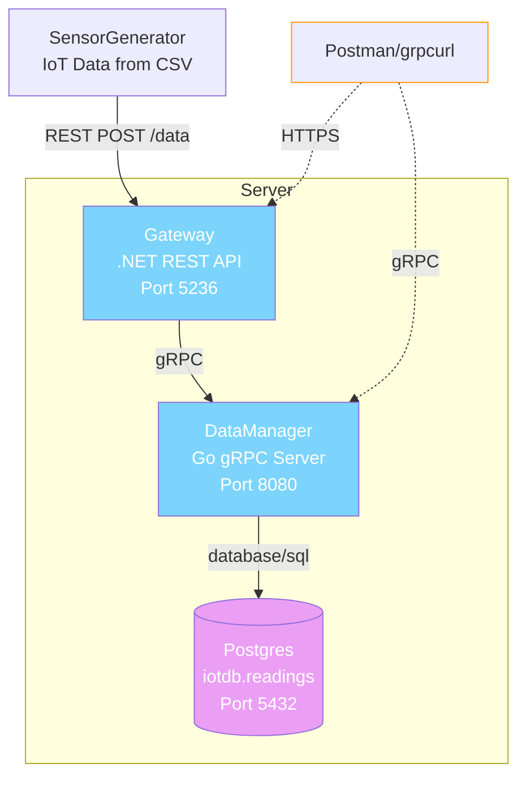

# Internet of Things and Services – Project

This repository contains multiple projects built as part of an **Internet of Things and Services** course. The system demonstrates a microservice-based architecture for managing, processing, and visualizing environmental sensor data.

Each project is containerized using **Docker Compose** and connected through a common network for seamless interoperability.

---

## 🧱 Overall Architecture

The entire system is structured as a set of loosely coupled microservices, each responsible for a specific task:

- **Data Manager:** gRPC-based data service written in Go.  
- **Gateway:** ASP.NET Core MVC application that acts as an API gateway.  
- **Sensor Generator:** Python script that simulates IoT sensor data.  

A structural diagram of the system (coming soon) illustrates how containers communicate using both HTTP and gRPC protocols.

The dataset used for simulation is sourced from [Environmental Sensor Data on Kaggle](https://www.kaggle.com/datasets/garystafford/environmental-sensor-data-132k).

---

## 📦 Project 1 – Environmental Data System

### 1. Data Manager (Go)

A **gRPC service** responsible for data storage and CRUD operations.

- Connects to **PostgreSQL**.
- Exposes methods over **gRPC** (runs on HTTP/2).
- Listens on a TCP port to handle remote procedure calls from other services.
- Implements protobuf definitions for data models and RPC methods.

### 2. Gateway (ASP.NET Core 10 MVC)

An **API Gateway and frontend** that communicates with the Data Manager via gRPC.

- Uses **OpenAPI** for [documentation.](https://app.swaggerhub.com/apis/elfak-695/Project1/1.0.0)  
- Implements **MVC architecture** for a clean separation of concerns.  
- Provides a REST interface for clients to access sensor data.  
- Forwards data operations to the Data Manager via gRPC calls.

### 3. Sensor Generator (Python)

A lightweight **data simulator** that mimics IoT devices by sending sensor readings.

- Reads environmental data from the Kaggle CSV file.  
- Randomly selects rows and sends HTTP requests to the Gateway API.  
- Designed for testing and system load simulation.

---

## 🐳 Docker Setup

All services are containerized and orchestrated using **Docker Compose**.

- Each component (Gateway, Data Manager, PostgreSQL) runs in its own container.
- Shared network **iot-net** enables cross-service communication.
- Environment variables handle ports, credentials, and connection strings.

## ⚙️ How to Run Locally

The simplest way to start all services together:

```bash
docker-compose up --build
```

This command will:
- Build and start the **PostgreSQL**, **Data Manager**, **Gateway**, and containers.
- Create a shared Docker network for service communication.
- Expose ports as configured inside `docker-compose.yml`.

Once started:
- Gateway should be available at: [**http://localhost:5237**](http://localhost:5237)
- Data Manager runs internally and communicates via gRPC.

To stop containers:

```bash
docker-compose down
```

---

## 📈 Future Projects

### Project 2 – TBD
_(Placeholder for upcoming expansion: e.g. real-time analytics or dashboard integration)_

### Project 3 – TBD
_(Potential service for notification, ML predictions, or sensor anomaly detection)_

---

## 📚 Technologies Used

| Component | Language / Framework | Key Features |
|------------|---------------------|---------------|
| Data Manager | Go | gRPC, PostgreSQL, CRUD over RPC |
| Gateway | ASP.NET Core 10 | MVC, REST + gRPC integration, OpenAPI |
| Sensor Generator | Python | Data simulation, HTTP client |
| Infrastructure | Docker, Docker Compose | Containerization, orchestration |
